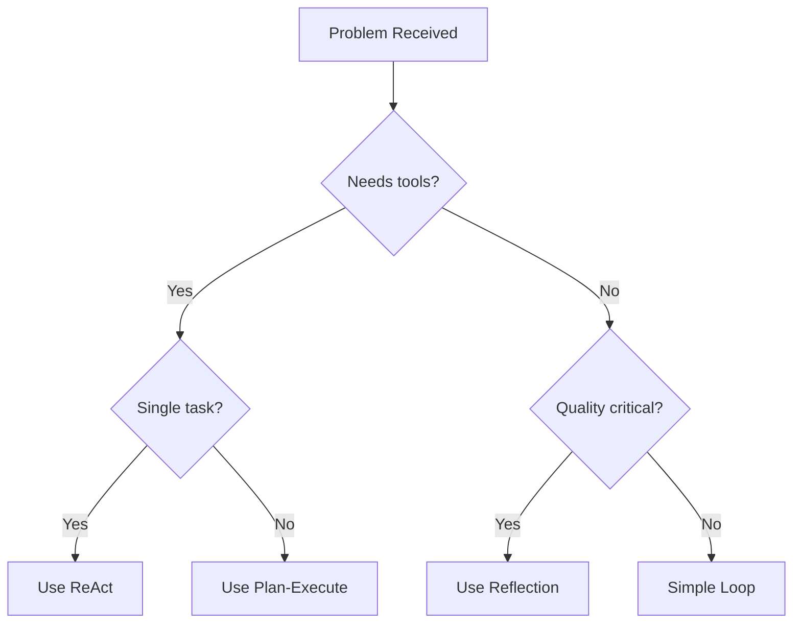

# Tutorial 16: Loop Strategies in Workflows

Learn how to leverage claude-php-agent's advanced loop strategies (ReAct, Reflection, Plan-Execute) within ASL workflows for sophisticated reasoning patterns.

## What You'll Learn

- Understanding different loop strategies and when to use them
- Wrapping ReAct loop agents for iterative tool-based reasoning
- Using Reflection loops for self-improving responses
- Implementing Plan-Execute for complex task decomposition
- Building an autonomous problem-solving workflow

## Prerequisites

- Completed [Tutorial 15: Multi-Agent Orchestration](15-multi-agent-orchestration.md)
- Understanding of claude-php-agent loop concepts

## Loop Strategy Overview

claude-php-agent provides three main loop strategies:

| Strategy | Pattern | Best For |
|----------|---------|----------|
| **ReAct** | Reason → Act → Observe → Repeat | Tool-based problem solving |
| **Reflection** | Generate → Critique → Refine | Quality improvement |
| **Plan-Execute** | Plan → Execute Steps → Verify | Complex multi-step tasks |

## Step 1: Understanding Loop Strategies

### ReAct Loop

The ReAct (Reasoning + Acting) loop:

```
1. THOUGHT: Agent reasons about what to do
2. ACTION: Agent calls a tool
3. OBSERVATION: Agent sees tool result
4. Repeat until ANSWER
```

### Reflection Loop

The Reflection loop improves output quality:

```
1. GENERATE: Create initial response
2. CRITIQUE: Evaluate response quality
3. REFINE: Improve based on critique
4. Repeat until quality threshold met
```

### Plan-Execute Loop

The Plan-Execute loop handles complex tasks:

```
1. PLAN: Break task into steps
2. EXECUTE: Run each step
3. VERIFY: Check step completion
4. ADAPT: Adjust plan if needed
```

## Step 2: Create Loop Strategy Adapters

Create `src/Adapters/LoopStrategyAdapter.php`:

```php
<?php

namespace MyOrg\Adapters;

use AgentStateLanguage\Agents\AgentInterface;
use ClaudeAgents\Agent;
use ClaudeAgents\AgentResult;
use ClaudeAgents\Loops\ReactLoop;
use ClaudeAgents\Loops\ReflectionLoop;
use ClaudeAgents\Loops\PlanExecuteLoop;
use ClaudeAgents\Contracts\ToolInterface;
use ClaudePhp\ClaudePhp;
use Psr\Log\LoggerInterface;
use Psr\Log\NullLogger;

/**
 * Adapter that exposes claude-php-agent loop strategies to ASL.
 */
class LoopStrategyAdapter implements AgentInterface
{
    private Agent $agent;
    private string $name;
    private string $strategyType;
    private array $executionTrace = [];
    private ?AgentResult $lastResult = null;

    public function __construct(string $name, Agent $agent, string $strategyType)
    {
        $this->name = $name;
        $this->agent = $agent;
        $this->strategyType = $strategyType;
    }

    /**
     * Create a ReAct loop agent.
     *
     * @param string $name Agent name
     * @param ClaudePhp $client Claude client
     * @param array<ToolInterface> $tools Available tools
     * @param string $systemPrompt System prompt
     * @param LoggerInterface|null $logger Logger instance
     */
    public static function react(
        string $name,
        ClaudePhp $client,
        array $tools = [],
        string $systemPrompt = '',
        ?LoggerInterface $logger = null
    ): self {
        $logger = $logger ?? new NullLogger();

        $agent = Agent::create($client)
            ->withName($name)
            ->withSystemPrompt($systemPrompt)
            ->withTools($tools)
            ->withLoopStrategy(new ReactLoop($logger))
            ->withLogger($logger)
            ->maxIterations(10);

        return new self($name, $agent, 'react');
    }

    /**
     * Create a Reflection loop agent.
     *
     * @param string $name Agent name
     * @param ClaudePhp $client Claude client
     * @param string $systemPrompt System prompt
     * @param int $qualityThreshold Score threshold (1-10)
     * @param int $maxRefinements Maximum refinement iterations
     * @param LoggerInterface|null $logger Logger instance
     */
    public static function reflection(
        string $name,
        ClaudePhp $client,
        string $systemPrompt = '',
        int $qualityThreshold = 8,
        int $maxRefinements = 3,
        ?LoggerInterface $logger = null
    ): self {
        $logger = $logger ?? new NullLogger();

        $reflectionLoop = new ReflectionLoop($logger);
        $reflectionLoop->setQualityThreshold($qualityThreshold);
        $reflectionLoop->setMaxRefinements($maxRefinements);

        $agent = Agent::create($client)
            ->withName($name)
            ->withSystemPrompt($systemPrompt)
            ->withLoopStrategy($reflectionLoop)
            ->withLogger($logger);

        return new self($name, $agent, 'reflection');
    }

    /**
     * Create a Plan-Execute loop agent.
     *
     * @param string $name Agent name
     * @param ClaudePhp $client Claude client
     * @param array<ToolInterface> $tools Available tools
     * @param string $systemPrompt System prompt
     * @param LoggerInterface|null $logger Logger instance
     */
    public static function planExecute(
        string $name,
        ClaudePhp $client,
        array $tools = [],
        string $systemPrompt = '',
        ?LoggerInterface $logger = null
    ): self {
        $logger = $logger ?? new NullLogger();

        $agent = Agent::create($client)
            ->withName($name)
            ->withSystemPrompt($systemPrompt)
            ->withTools($tools)
            ->withLoopStrategy(new PlanExecuteLoop($logger))
            ->withLogger($logger)
            ->maxIterations(20);

        return new self($name, $agent, 'plan_execute');
    }

    /**
     * Execute with loop strategy tracking.
     */
    public function execute(array $parameters): array
    {
        $this->executionTrace = [];

        // Set up execution callbacks for tracing
        $this->configureCallbacks();

        // Extract task
        $task = $this->extractTask($parameters);

        // Run agent with loop strategy
        $this->lastResult = $this->agent->run($task);

        return $this->formatResult($this->lastResult);
    }

    public function getName(): string
    {
        return $this->name;
    }

    /**
     * Get the execution trace for debugging.
     */
    public function getExecutionTrace(): array
    {
        return $this->executionTrace;
    }

    /**
     * Get the loop strategy type.
     */
    public function getStrategyType(): string
    {
        return $this->strategyType;
    }

    /**
     * Get the underlying agent.
     */
    public function getAgent(): Agent
    {
        return $this->agent;
    }

    /**
     * Configure callbacks for execution tracing.
     */
    private function configureCallbacks(): void
    {
        $this->agent->onIteration(function (int $iteration, $response, $context) {
            $this->executionTrace[] = [
                'type' => 'iteration',
                'number' => $iteration,
                'timestamp' => date('c'),
            ];
        });

        $this->agent->onToolExecution(function (string $tool, array $input, $result) {
            $this->executionTrace[] = [
                'type' => 'tool_call',
                'tool' => $tool,
                'input' => $input,
                'timestamp' => date('c'),
            ];
        });

        // Strategy-specific callbacks
        if ($this->strategyType === 'plan_execute') {
            $this->agent->onPlanCreated(function (array $steps, $context) {
                $this->executionTrace[] = [
                    'type' => 'plan_created',
                    'steps' => $steps,
                    'stepCount' => count($steps),
                    'timestamp' => date('c'),
                ];
            });

            $this->agent->onStepComplete(function (int $step, string $desc, string $result) {
                $this->executionTrace[] = [
                    'type' => 'step_complete',
                    'step' => $step,
                    'description' => $desc,
                    'timestamp' => date('c'),
                ];
            });
        }

        if ($this->strategyType === 'reflection') {
            $this->agent->onReflection(function (int $refinement, int $score, string $feedback) {
                $this->executionTrace[] = [
                    'type' => 'reflection',
                    'refinement' => $refinement,
                    'score' => $score,
                    'feedback' => substr($feedback, 0, 200),
                    'timestamp' => date('c'),
                ];
            });
        }
    }

    /**
     * Extract task from parameters.
     */
    private function extractTask(array $parameters): string
    {
        foreach (['prompt', 'task', 'message', 'input', 'question'] as $key) {
            if (isset($parameters[$key])) {
                return (string) $parameters[$key];
            }
        }

        return json_encode($parameters, JSON_PRETTY_PRINT);
    }

    /**
     * Format result for ASL.
     */
    private function formatResult(AgentResult $result): array
    {
        $tokenUsage = $result->getTokenUsage();

        return [
            'response' => $result->getAnswer(),
            'success' => $result->isSuccess(),
            'iterations' => $result->getIterations(),
            'strategy' => $this->strategyType,
            'trace' => $this->executionTrace,
            '_tokens' => ($tokenUsage['input'] ?? 0) + ($tokenUsage['output'] ?? 0),
            '_cost' => $this->calculateCost($tokenUsage),
            '_usage' => $tokenUsage,
        ];
    }

    private function calculateCost(array $tokenUsage): float
    {
        $inputCost = (($tokenUsage['input'] ?? 0) / 1_000_000) * 3.00;
        $outputCost = (($tokenUsage['output'] ?? 0) / 1_000_000) * 15.00;
        return $inputCost + $outputCost;
    }
}
```

## Step 3: Create Strategy-Specific Tools

Create `src/Tools/ProblemSolvingTools.php`:

```php
<?php

namespace MyOrg\Tools;

use ClaudeAgents\Tools\Tool;

/**
 * Tools for problem-solving workflows.
 */
class ProblemSolvingTools
{
    /**
     * Tool to break down a problem.
     */
    public static function problemBreakdown(): Tool
    {
        return Tool::create('break_down_problem')
            ->description('Break a complex problem into smaller, manageable sub-problems.')
            ->stringParam('problem', 'The problem to break down')
            ->numberParam('maxParts', 'Maximum number of parts', false)
            ->handler(function (array $input): string {
                $problem = $input['problem'] ?? '';
                $maxParts = $input['maxParts'] ?? 5;

                // In production, this might use an AI call or algorithm
                return json_encode([
                    'originalProblem' => $problem,
                    'subProblems' => [
                        'Identify the core issue',
                        'Gather relevant information',
                        'Analyze dependencies',
                        'Design solution approach',
                        'Validate solution',
                    ],
                    'estimatedComplexity' => 'medium',
                ]);
            });
    }

    /**
     * Tool to search knowledge base.
     */
    public static function knowledgeSearch(): Tool
    {
        return Tool::create('search_knowledge')
            ->description('Search the knowledge base for relevant information.')
            ->stringParam('query', 'Search query')
            ->stringParam('category', 'Category filter', false)
            ->handler(function (array $input): string {
                $query = $input['query'] ?? '';
                $category = $input['category'] ?? 'all';

                // Simulated knowledge base search
                return json_encode([
                    'query' => $query,
                    'results' => [
                        [
                            'title' => 'Relevant Documentation',
                            'content' => "Information about {$query}...",
                            'relevance' => 0.95,
                        ],
                        [
                            'title' => 'Best Practices Guide',
                            'content' => "Guidelines for {$query}...",
                            'relevance' => 0.87,
                        ],
                    ],
                    'totalResults' => 2,
                ]);
            });
    }

    /**
     * Tool to validate a solution.
     */
    public static function validateSolution(): Tool
    {
        return Tool::create('validate_solution')
            ->description('Validate a proposed solution against requirements.')
            ->stringParam('solution', 'The proposed solution')
            ->arrayParam('requirements', 'List of requirements to check')
            ->handler(function (array $input): string {
                $solution = $input['solution'] ?? '';
                $requirements = $input['requirements'] ?? [];

                $validations = [];
                foreach ($requirements as $req) {
                    $validations[] = [
                        'requirement' => $req,
                        'met' => true, // Simulated
                        'confidence' => 0.9,
                    ];
                }

                return json_encode([
                    'valid' => true,
                    'validations' => $validations,
                    'overallConfidence' => 0.88,
                ]);
            });
    }

    /**
     * Tool to execute a solution step.
     */
    public static function executeStep(): Tool
    {
        return Tool::create('execute_step')
            ->description('Execute a single step of the solution plan.')
            ->stringParam('step', 'Step description')
            ->stringParam('context', 'Current context', false)
            ->handler(function (array $input): string {
                $step = $input['step'] ?? '';
                $context = $input['context'] ?? '';

                return json_encode([
                    'step' => $step,
                    'status' => 'completed',
                    'output' => "Successfully executed: {$step}",
                    'duration' => '0.5s',
                ]);
            });
    }

    /**
     * Get all problem-solving tools.
     */
    public static function all(): array
    {
        return [
            self::problemBreakdown(),
            self::knowledgeSearch(),
            self::validateSolution(),
            self::executeStep(),
        ];
    }
}
```

## Step 4: Define the Workflow

Create `workflows/problem-solver.asl.json`:

```json
{
  "Comment": "Autonomous problem-solving workflow with loop strategies",
  "Version": "1.0",
  "StartAt": "ClassifyProblem",
  "States": {
    "ClassifyProblem": {
      "Type": "Task",
      "Agent": "ProblemClassifier",
      "Parameters": {
        "prompt.$": "States.Format('Classify this problem and determine the best approach:\n\nProblem: {}\n\nClassify as: SIMPLE (direct answer), COMPLEX (needs breakdown), or RESEARCH (needs information gathering). Respond in JSON format: {\"type\": \"...\", \"confidence\": 0.0-1.0, \"reasoning\": \"...\"}', $.problem)"
      },
      "ResultPath": "$.classification",
      "Next": "ChooseStrategy"
    },
    "ChooseStrategy": {
      "Type": "Choice",
      "Choices": [
        {
          "Variable": "$.classification.parsed.type",
          "StringEquals": "SIMPLE",
          "Next": "DirectAnswer"
        },
        {
          "Variable": "$.classification.parsed.type",
          "StringEquals": "RESEARCH",
          "Next": "ResearchWithReact"
        }
      ],
      "Default": "PlanAndExecute"
    },
    "DirectAnswer": {
      "Type": "Task",
      "Agent": "ReflectiveAnswerer",
      "Comment": "Use Reflection loop for quality-focused direct answers",
      "Parameters": {
        "prompt.$": "States.Format('Provide a thorough, high-quality answer to this question:\n\n{}', $.problem)"
      },
      "ResultPath": "$.answer",
      "Next": "FormatResult"
    },
    "ResearchWithReact": {
      "Type": "Task",
      "Agent": "ReactResearcher",
      "Comment": "Use ReAct loop for tool-based research",
      "Parameters": {
        "prompt.$": "States.Format('Research and answer this question using available tools:\n\n{}\n\nUse search_knowledge to find relevant information, then synthesize an answer.', $.problem)"
      },
      "Tools": {
        "Allowed": ["search_knowledge", "break_down_problem"]
      },
      "ResultPath": "$.research",
      "Next": "RefineResearch"
    },
    "RefineResearch": {
      "Type": "Task",
      "Agent": "ReflectiveAnswerer",
      "Comment": "Use Reflection to refine research results",
      "Parameters": {
        "prompt.$": "States.Format('Based on this research, provide a comprehensive answer:\n\nOriginal Question: {}\n\nResearch Findings: {}\n\nProvide a well-structured, accurate answer.', $.problem, $.research.response)"
      },
      "ResultPath": "$.answer",
      "Next": "FormatResult"
    },
    "PlanAndExecute": {
      "Type": "Task",
      "Agent": "PlanExecutor",
      "Comment": "Use Plan-Execute loop for complex problems",
      "Parameters": {
        "prompt.$": "States.Format('Solve this complex problem step by step:\n\n{}\n\nCreate a plan, execute each step, and provide a complete solution. Use break_down_problem to decompose the problem, search_knowledge for information, execute_step for each action, and validate_solution to verify your answer.', $.problem)"
      },
      "Tools": {
        "Allowed": ["break_down_problem", "search_knowledge", "execute_step", "validate_solution"]
      },
      "ResultPath": "$.solution",
      "Next": "ValidateSolution"
    },
    "ValidateSolution": {
      "Type": "Task",
      "Agent": "ReflectiveAnswerer",
      "Comment": "Use Reflection to validate and refine the solution",
      "Parameters": {
        "prompt.$": "States.Format('Review and validate this solution:\n\nProblem: {}\n\nProposed Solution: {}\n\nCritique the solution, identify any issues, and provide the final refined answer.', $.problem, $.solution.response)"
      },
      "ResultPath": "$.validated",
      "Next": "CheckValidation"
    },
    "CheckValidation": {
      "Type": "Choice",
      "Choices": [
        {
          "Variable": "$.validated.success",
          "BooleanEquals": true,
          "Next": "FormatResult"
        }
      ],
      "Default": "FallbackAnswer"
    },
    "FallbackAnswer": {
      "Type": "Task",
      "Agent": "ReflectiveAnswerer",
      "Parameters": {
        "prompt.$": "States.Format('Provide the best possible answer for: {}', $.problem)"
      },
      "ResultPath": "$.answer",
      "Next": "FormatResult"
    },
    "FormatResult": {
      "Type": "Pass",
      "Parameters": {
        "problem.$": "$.problem",
        "classification.$": "$.classification.parsed",
        "answer.$": "States.Coalesce($.answer.response, $.validated.response, $.solution.response)",
        "strategy": {
          "type.$": "$.classification.parsed.type",
          "loopsUsed.$": "States.Array('classification', $.classification.strategy, $.answer.strategy)"
        },
        "executionTrace": {
          "classification.$": "$.classification.trace",
          "mainExecution.$": "States.Coalesce($.answer.trace, $.solution.trace, $.research.trace)"
        },
        "metrics": {
          "totalTokens.$": "States.MathAdd($.classification._tokens, $.answer._tokens)",
          "totalCost.$": "States.MathAdd($.classification._cost, $.answer._cost)",
          "iterations.$": "States.MathAdd($.classification.iterations, $.answer.iterations)"
        }
      },
      "End": true
    }
  }
}
```

## Step 5: Run the Workflow

Create `run-problem-solver.php`:

```php
<?php

require_once 'vendor/autoload.php';

use AgentStateLanguage\Engine\WorkflowEngine;
use AgentStateLanguage\Agents\AgentRegistry;
use ClaudePhp\ClaudePhp;
use MyOrg\Adapters\LoopStrategyAdapter;
use MyOrg\Tools\ProblemSolvingTools;

// Initialize
$client = ClaudePhp::make(getenv('ANTHROPIC_API_KEY'));

// Create agents with different loop strategies

// Simple classifier (standard loop)
$classifier = LoopStrategyAdapter::react(
    'ProblemClassifier',
    $client,
    [], // No tools needed for classification
    'You are a problem classifier. Analyze problems and categorize them as SIMPLE, COMPLEX, or RESEARCH. Always respond in JSON format.'
);

// ReAct agent for research tasks
$reactResearcher = LoopStrategyAdapter::react(
    'ReactResearcher',
    $client,
    ProblemSolvingTools::all(),
    'You are a research agent. Use tools to gather information and synthesize answers. Think step by step, use tools when needed, and provide comprehensive answers.'
);

// Reflection agent for quality-focused answers
$reflectiveAnswerer = LoopStrategyAdapter::reflection(
    'ReflectiveAnswerer',
    $client,
    'You are a thoughtful answerer. Generate high-quality responses, critique them, and refine until excellent. Focus on accuracy, clarity, and completeness.',
    8,  // Quality threshold (1-10)
    3   // Max refinements
);

// Plan-Execute agent for complex problems
$planExecutor = LoopStrategyAdapter::planExecute(
    'PlanExecutor',
    $client,
    ProblemSolvingTools::all(),
    'You are a systematic problem solver. Break complex problems into steps, execute each step, and verify the solution. Create clear plans and follow them methodically.'
);

// Register agents
$registry = new AgentRegistry();
$registry->register('ProblemClassifier', $classifier);
$registry->register('ReactResearcher', $reactResearcher);
$registry->register('ReflectiveAnswerer', $reflectiveAnswerer);
$registry->register('PlanExecutor', $planExecutor);

// Load workflow
$engine = WorkflowEngine::fromFile('workflows/problem-solver.asl.json', $registry);

// Test problems of different complexity
$problems = [
    'SIMPLE' => 'What is the capital of France?',
    'RESEARCH' => 'What are the best practices for implementing caching in a PHP application?',
    'COMPLEX' => 'Design a microservices architecture for an e-commerce platform that needs to handle 10,000 concurrent users with high availability.',
];

foreach ($problems as $type => $problem) {
    echo "\n" . str_repeat('=', 70) . "\n";
    echo "Testing {$type} problem\n";
    echo str_repeat('=', 70) . "\n\n";

    echo "Problem: " . substr($problem, 0, 60) . "...\n\n";

    $result = $engine->run(['problem' => $problem]);

    if ($result->isSuccess()) {
        $output = $result->getOutput();

        echo "Classification: {$output['classification']['type']} ";
        echo "(confidence: " . number_format($output['classification']['confidence'] * 100, 0) . "%)\n\n";

        echo "Answer:\n";
        echo wordwrap($output['answer'], 70) . "\n\n";

        echo "Strategy Used:\n";
        echo "- Problem Type: {$output['strategy']['type']}\n";
        
        // Show execution trace summary
        $trace = $output['executionTrace']['mainExecution'] ?? [];
        $iterations = count(array_filter($trace, fn($t) => $t['type'] === 'iteration'));
        $toolCalls = count(array_filter($trace, fn($t) => $t['type'] === 'tool_call'));
        $reflections = count(array_filter($trace, fn($t) => $t['type'] === 'reflection'));

        echo "- Iterations: {$iterations}\n";
        echo "- Tool Calls: {$toolCalls}\n";
        echo "- Reflections: {$reflections}\n\n";

        echo "Metrics:\n";
        echo "- Tokens: {$output['metrics']['totalTokens']}\n";
        echo "- Cost: $" . number_format($output['metrics']['totalCost'], 4) . "\n";
        echo "- Duration: " . number_format($result->getDuration(), 2) . "s\n";
    } else {
        echo "Error: " . $result->getError() . "\n";
    }
}
```

## Expected Output

```
======================================================================
Testing SIMPLE problem
======================================================================

Problem: What is the capital of France?...

Classification: SIMPLE (confidence: 98%)

Answer:
The capital of France is Paris. Paris is not only the capital but also 
the largest city in France, serving as the country's political, 
economic, and cultural center. It is located in the north-central 
part of France along the Seine River.

Strategy Used:
- Problem Type: SIMPLE
- Iterations: 2
- Tool Calls: 0
- Reflections: 2

Metrics:
- Tokens: 892
- Cost: $0.0156
- Duration: 3.21s

======================================================================
Testing RESEARCH problem
======================================================================

Problem: What are the best practices for implementing caching in a P...

Classification: RESEARCH (confidence: 92%)

Answer:
Best practices for implementing caching in PHP applications:

1. **Choose the Right Cache Backend**
   - Use Redis or Memcached for distributed caching
   - Consider APCu for single-server scenarios

2. **Implement Cache Strategies**
   - Cache-aside: Application manages cache population
   - Write-through: Update cache on writes
   - Write-behind: Async cache updates

3. **Set Appropriate TTLs**
   - Short TTLs for frequently changing data
   - Longer TTLs for static content

[... continued ...]

Strategy Used:
- Problem Type: RESEARCH
- Iterations: 5
- Tool Calls: 3
- Reflections: 2

Metrics:
- Tokens: 2847
- Cost: $0.0523
- Duration: 8.92s

======================================================================
Testing COMPLEX problem
======================================================================

Problem: Design a microservices architecture for an e-commerce platf...

Classification: COMPLEX (confidence: 95%)

Answer:
# E-Commerce Microservices Architecture

## Service Decomposition

1. **User Service**: Authentication, profiles, preferences
2. **Product Catalog**: Product CRUD, search, categories
3. **Inventory Service**: Stock management, reservations
4. **Order Service**: Order processing, history
5. **Payment Service**: Payment processing, refunds
6. **Notification Service**: Email, SMS, push notifications

## High Availability Strategy

- Deploy across multiple availability zones
- Use Kubernetes for orchestration
- Implement circuit breakers with resilience patterns
- Database replication with read replicas

[... detailed architecture ...]

Strategy Used:
- Problem Type: COMPLEX
- Iterations: 12
- Tool Calls: 8
- Reflections: 3

Metrics:
- Tokens: 5621
- Cost: $0.1034
- Duration: 18.45s
```

## Loop Strategy Comparison

| Aspect | ReAct | Reflection | Plan-Execute |
|--------|-------|------------|--------------|
| **Iterations** | Variable | Fixed max | Step-based |
| **Tool Use** | Heavy | None | Moderate |
| **Quality Focus** | Task completion | Output quality | Step verification |
| **Best For** | Research, data gathering | Writing, analysis | Complex multi-step |
| **Token Usage** | Higher | Moderate | Highest |

## Choosing the Right Strategy



## Experiment

Try these modifications:

### Combine Strategies

```php
// Use Plan-Execute for planning, then ReAct for each step
$hybridAgent = LoopStrategyAdapter::planExecute(
    'HybridSolver',
    $client,
    $tools,
    'Create a plan, then use ReAct-style reasoning for each step.'
);
```

### Adjust Reflection Thresholds

```php
// Higher quality requirement
$highQuality = LoopStrategyAdapter::reflection(
    'PerfectionistWriter',
    $client,
    'You produce exceptional content.',
    9,  // Very high threshold
    5   // More refinement attempts
);
```

### Track Detailed Execution

```php
$agent->getAgent()->onIteration(function ($i, $response, $context) {
    echo "[Iteration {$i}] Thinking...\n";
});

$agent->getAgent()->onToolExecution(function ($tool, $input, $result) {
    echo "[Tool] {$tool}(" . json_encode($input) . ")\n";
});
```

## Common Mistakes

### Wrong Strategy for Task

```
Problem: Simple factual question uses Plan-Execute
Result: Excessive iterations, high token usage
```

**Fix**: Classify problems first and route to appropriate strategy.

### Missing Tools for ReAct

```
Error: Agent stuck in loop - no tools to make progress
```

**Fix**: Ensure ReAct agents have relevant tools for their tasks.

### Reflection Threshold Too High

```
Warning: Max refinements reached without meeting quality threshold
```

**Fix**: Set realistic thresholds (7-8 is usually appropriate).

### Unbounded Iterations

```
Error: Max iterations exceeded
```

**Fix**: Set appropriate `maxIterations` and provide clear stopping criteria in prompts.

## Summary

You've learned:

- ✅ Understanding ReAct, Reflection, and Plan-Execute strategies
- ✅ Creating loop strategy adapters for ASL
- ✅ Routing problems to appropriate strategies
- ✅ Tracking execution traces across strategies
- ✅ Building autonomous problem-solving workflows
- ✅ Combining strategies for optimal results

## Next Steps

- [Tutorial 17: RAG-Enhanced Workflows](17-rag-enhanced-workflows.md) - Knowledge-augmented agents
